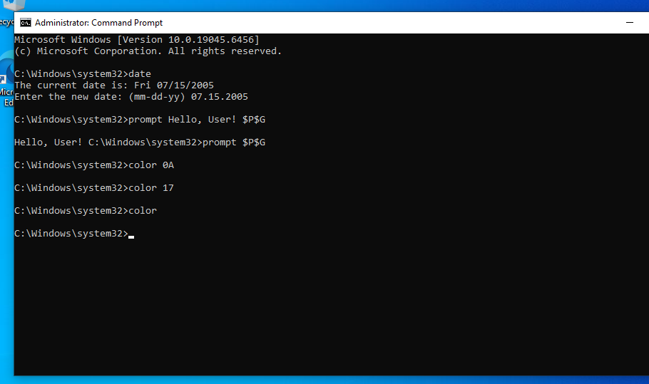
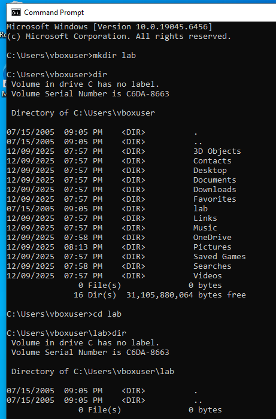
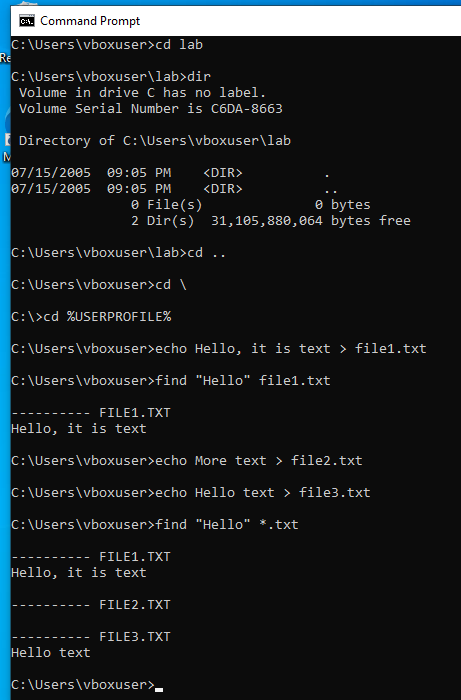
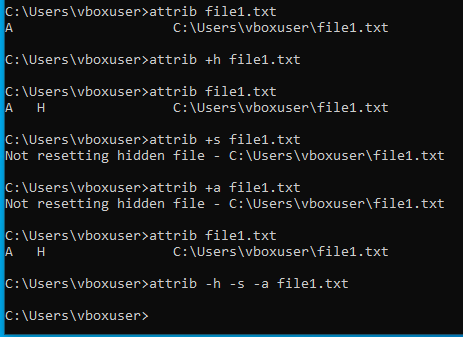

# Лабораторная работа № 1

## Задание 1 (работа с датой, приглашением, цветом)

```cmd
date                       # Показывает текущую системную дату
date 01-01-2000            # Устанавливает дату (формат: мм-дд-гггг)
prompt Hello, User! $P$G   # Меняет приглашение командной строки
color 0A                   # Меняет цвета: первая цифра - фон, вторая - текст
prompt $P$G                # Возвращает стандартное приглашение
```


## Задание 2 (работа с файловой системой)
```cmd
mkdir lab1_folder      # Создаёт новую папку
dir                    # Показывает список файлов и папок
cd lab1_folder         # Переходит в созданную папку
cd ..                  # Возвращается на уровень выше
cd \                   # Переходит в корень диска
cd %USERPROFILE%       # Переходит в профиль пользователя
echo Текст > file.txt  # Создаёт файл с текстом
find "Текст" file.txt  # Ищет строку в файле
find "Текст" *.txt     # Ищет строку во всех txt-файлах
```



## Задание 3 (работа с атрибутами)
```cmd
attrib file.txt        # Показывает атрибуты файла
attrib +h file.txt     # Устанавливает скрытый атрибут
attrib +s file.txt     # Устанавливает системный атрибут
attrib +a file.txt     # Устанавливает архивный атрибут
attrib -h -s -a file.txt # Снимает все атрибуты
```

