# Лабораторная работа № 2

## Задание 1–3 (echo on/off)
```cmd
echo off               # Отключает вывод самих команд
dir                    # Выполняется без показа команды
echo on                # Включает показ команд
```


## Задание 4 (создание t1.bat)
```cmd
echo off                 # Не показывать команды
cls                      # Очистить экран
echo мы студенты AIPET!  # Вывести текст
echo:                    # Вывести пустую строку
echo Hello!              # Вывести "Hello!"
```
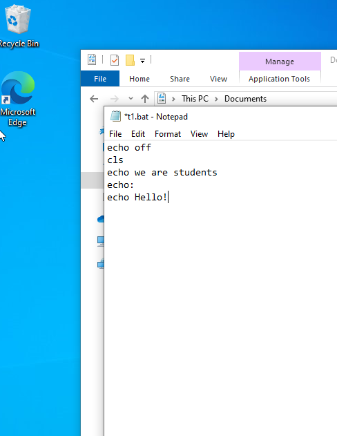
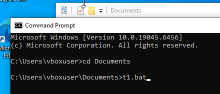
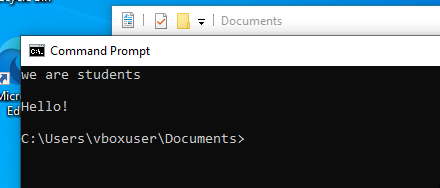

## Задание 5 (t2.bat)
```cmd
Rem это комментарий    # Rem - комментарий, не выполняется
```
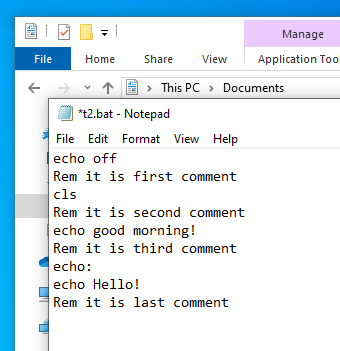
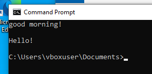

## Задание 6 (f1.bat и f2.bat)
### f1.bat:
```cmd
@echo off              # @ - скрывает саму команду echo off
type file1.txt         # Выводит содержимое файла
```

### f2.bat:
```cmd
@echo off
echo Запуск f1.bat...  # Сообщение пользователю
call f1.bat            # Вызов другого bat-файла
echo Готово.           # Сообщение после выполнения
```
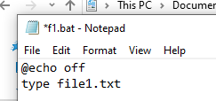
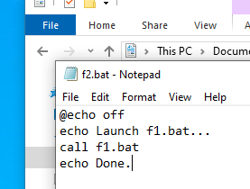
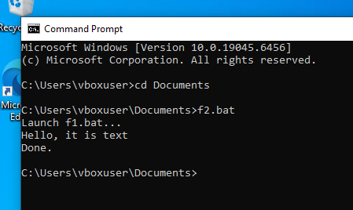

## Задание 7-11 (пауза, прерываемый файл, остаток от деления, переменная окружения, сравнение строк)
```cmd
pause                  # Приостанавливает выполнение
set /a result=10%3     # Остаток от деления
set /a div=10/3        # Целочисленное деление
set myvar=aipet        # Создаёт переменную
echo %myvar%           # Выводит значение
if %str1%==%str2%      # Сравнивает две строки
( ... ) else ( ... )   # Конструкция if-else
```
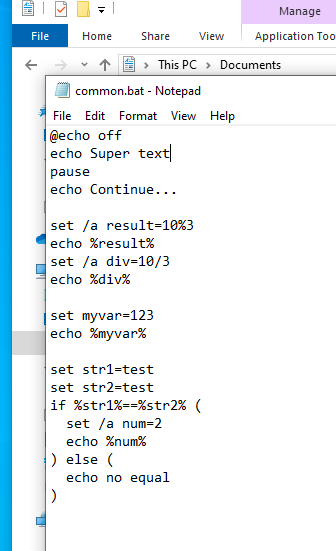
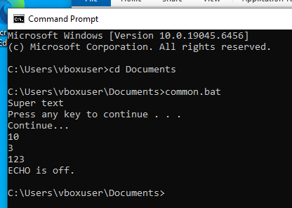

## Задание 12 (проверка файла)
```cmd
if exist %1           # Проверяет существование файла
                      # %1 - первый переданный параметр
```
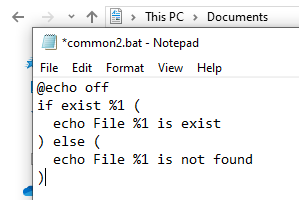
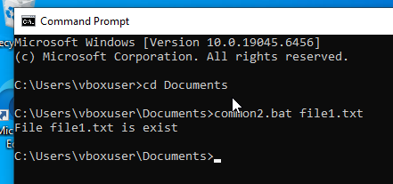

## Задание 13 (работа с каталогом и файлами)
```cmd
mkdir lab2_files      # Создаёт папку
cd lab2_files         # Переходит в неё
type *.txt            # Выводит содержимое всех txt-файлов
for %%f in (*.txt) do # Цикл по всем txt-файлам
type %%f              # Выводит содержимое каждого файла
```
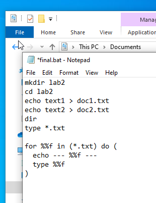
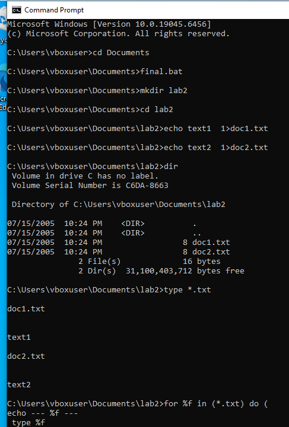
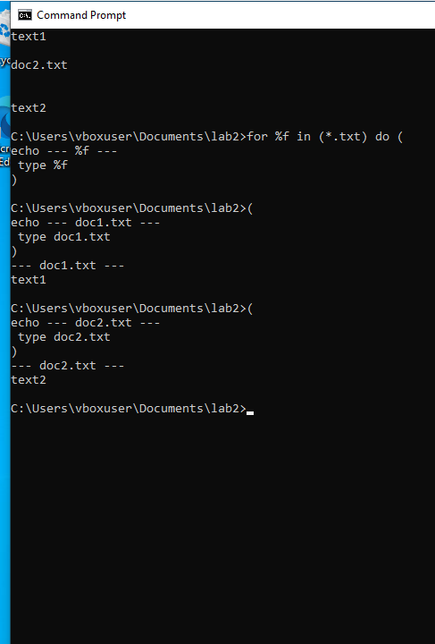
