# Лабораторная работа № 3

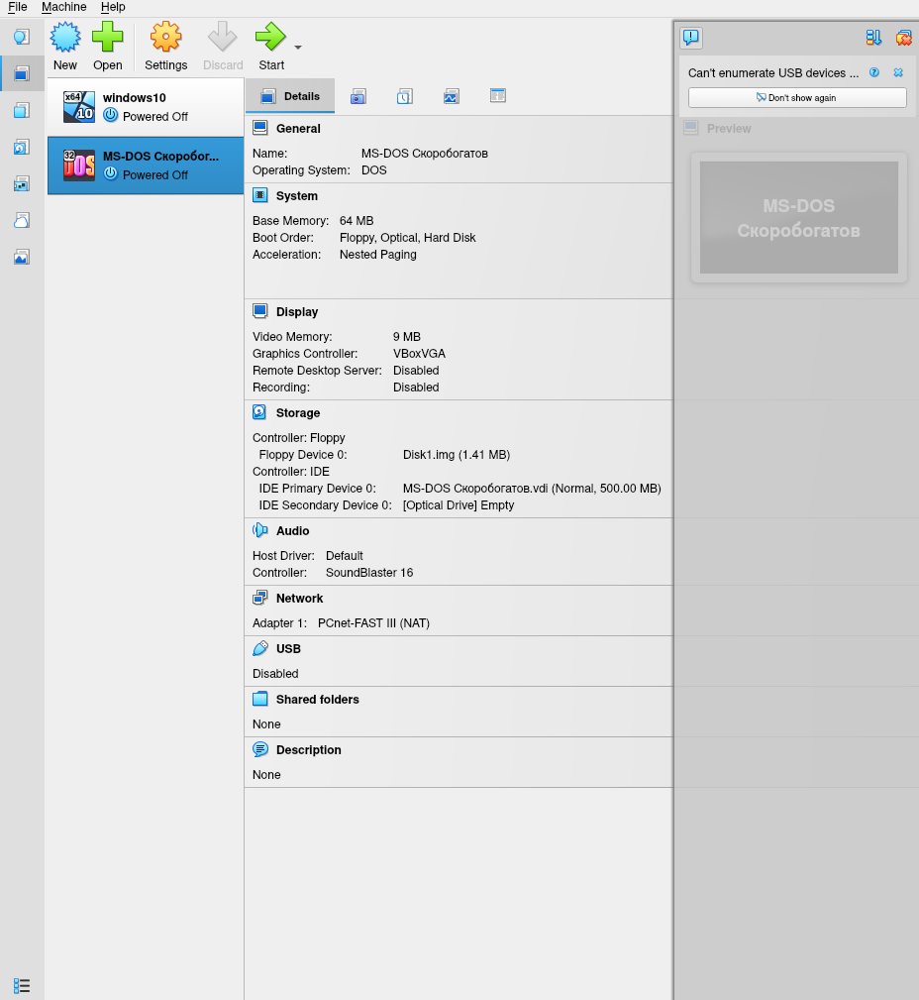
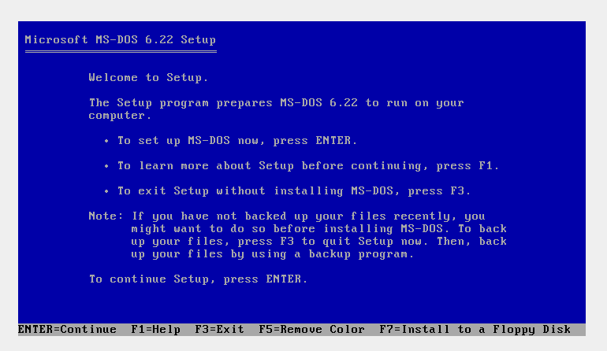
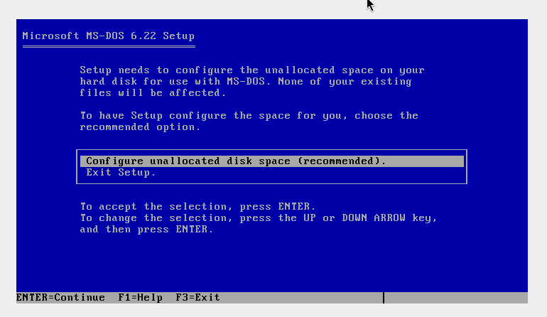
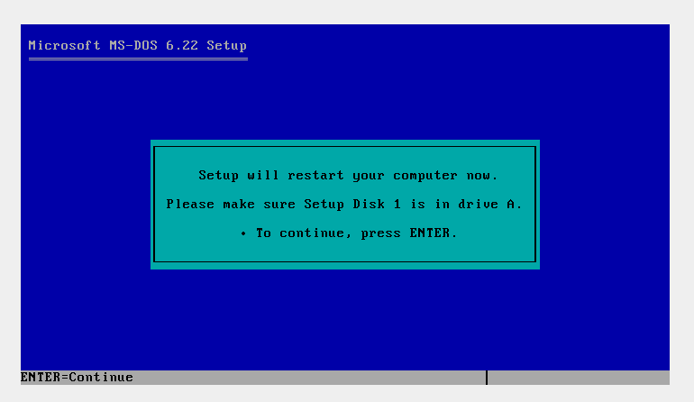
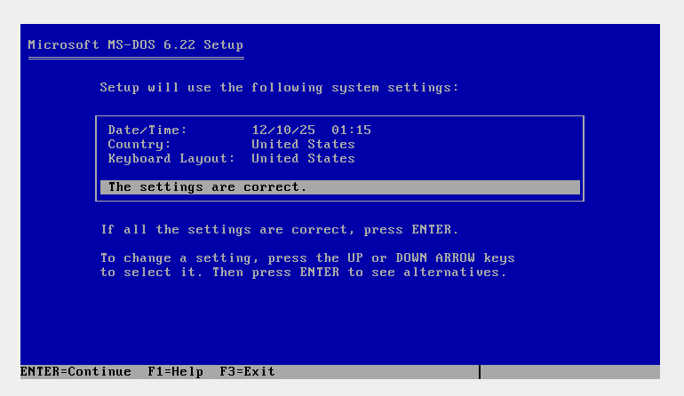
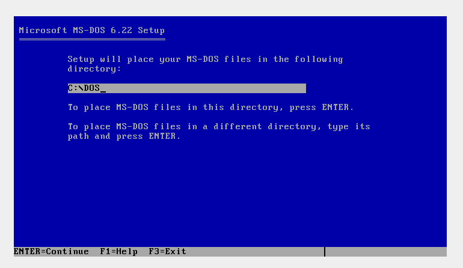
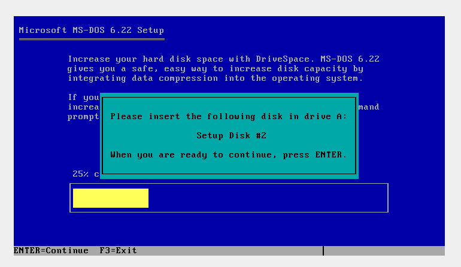
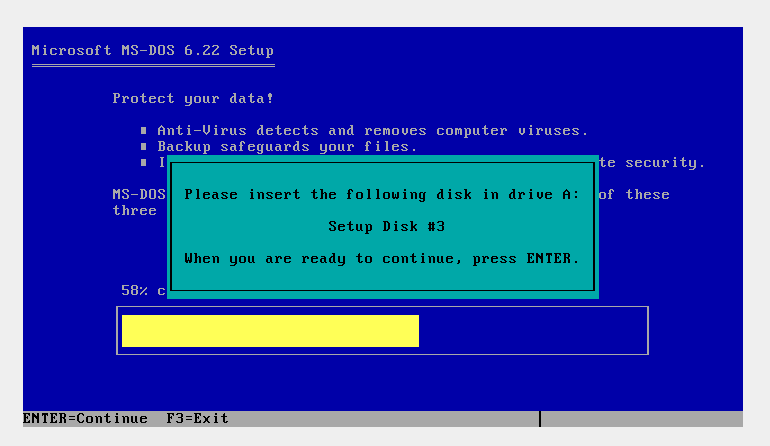
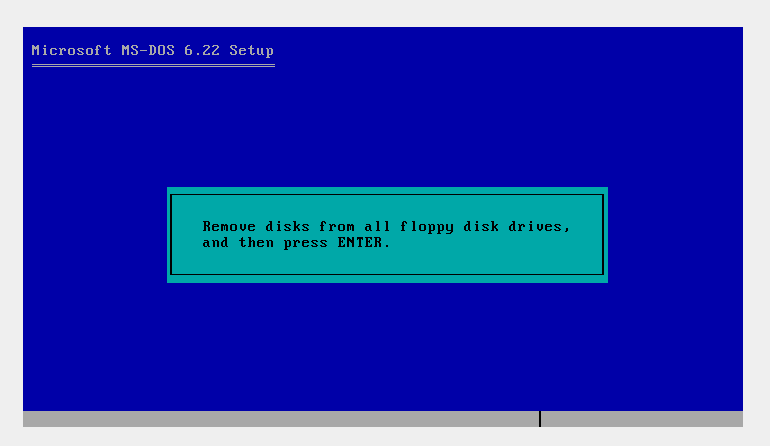
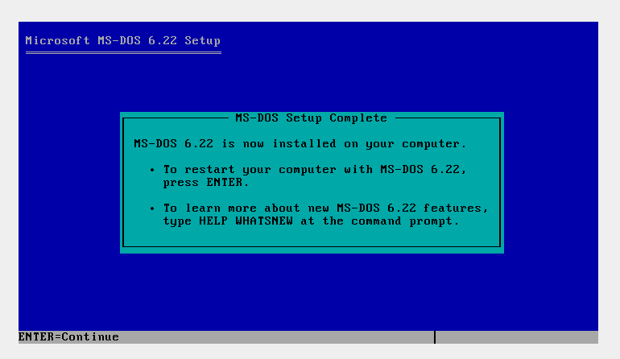


## Задание 1 Базовые команды MS-DOS
```dos
CLS                    ; Очистка экрана
VER                    ; Показать версию MS-DOS
DATE                   ; Показать/установить дату
TIME                   ; Показать/установить время
```
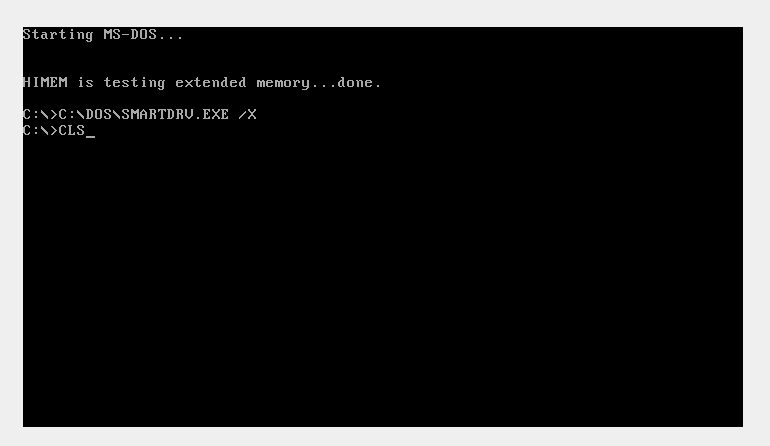
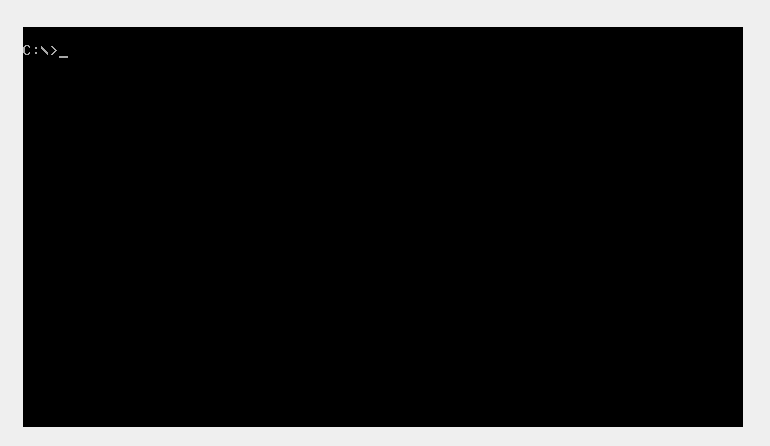
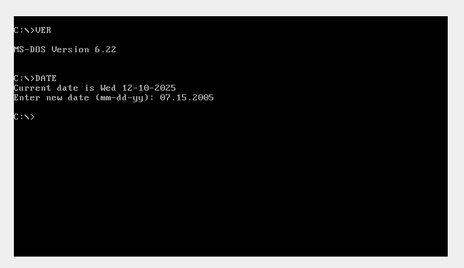

## Задание 2 Работа с файловой системой
```dos
MD OS                  ; Создать каталог OS
CD OS                  ; Перейти в каталог OS
EDIT 2.TXT             ; Создать файл 2.TXT
```
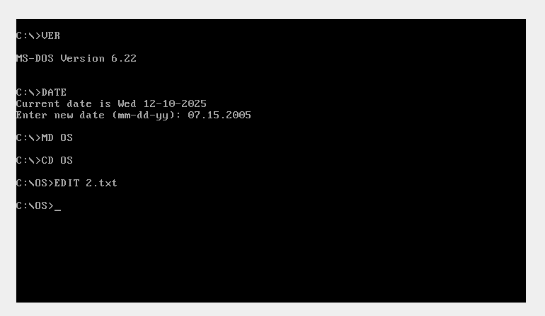

## Задание 3 Содержимое файла 2.TXT
```text
CLS
VER
DATE
TIME
DIR
CD
MD
RD
COPY
DEL
REN
TYPE
EDIT
```
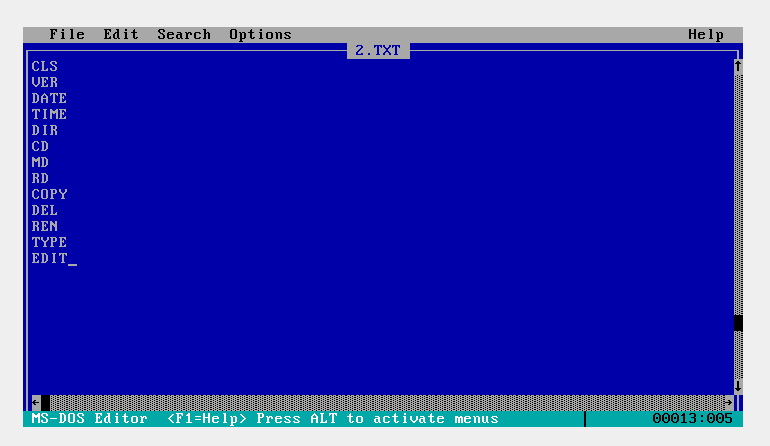
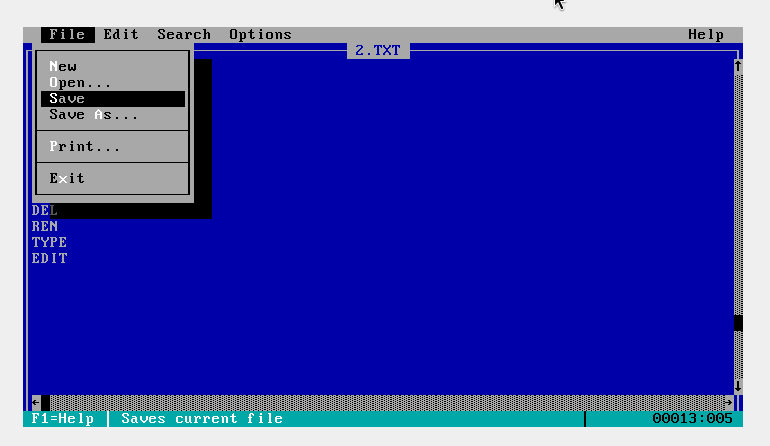

## Задание 4 Просмотр и проверка
```dos
TYPE 2.TXT             ; Просмотреть содержимое файла
DIR                    ; Убедиться, что файл создан
```
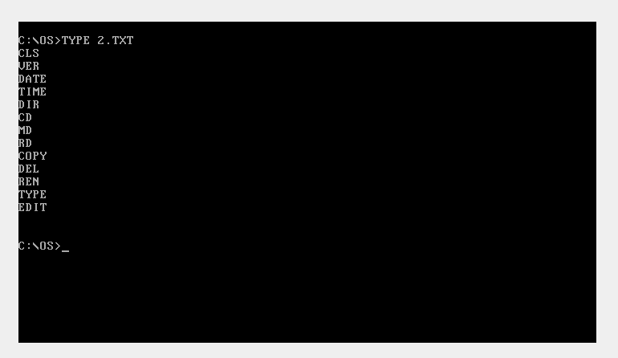
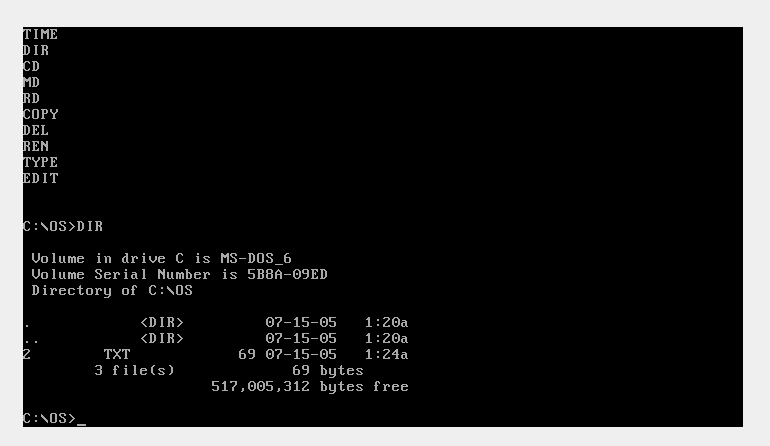

## Установка 5 файлового менеджера
```dos
NC.EXE                 ; Для Norton Commander
```
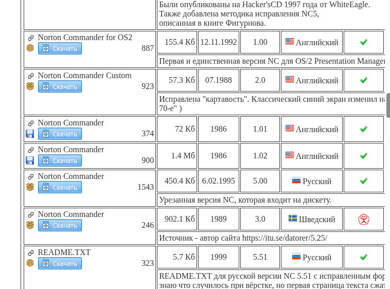
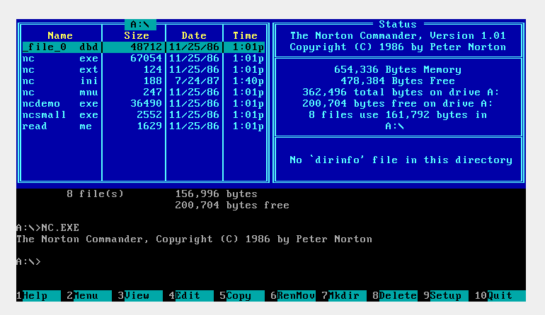
