# Лабораторная работа № 4

## Задание 1-2: Знакомство со справочной системой
```cmd
help Get-Command              # Полная справка по команде Get-Command
Get-Command                   # Список всех доступных команд в PowerShell
```
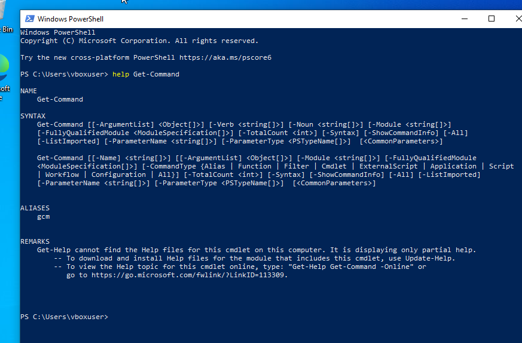

## Задание 3-4: Работа с сервисами и процессами
```cmd
Get-Service                   # Список всех сервисов на компьютере
Get-Process                   # Список всех запущенных процессов
```
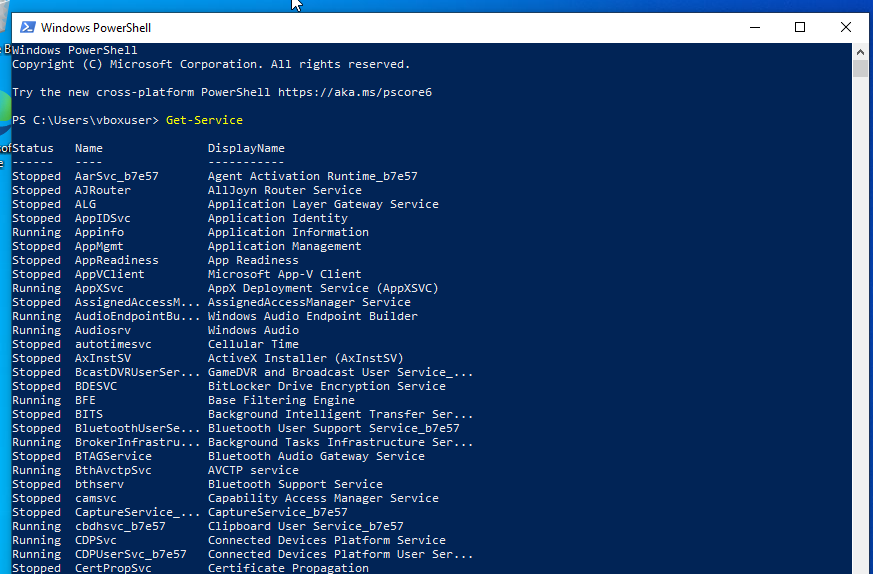
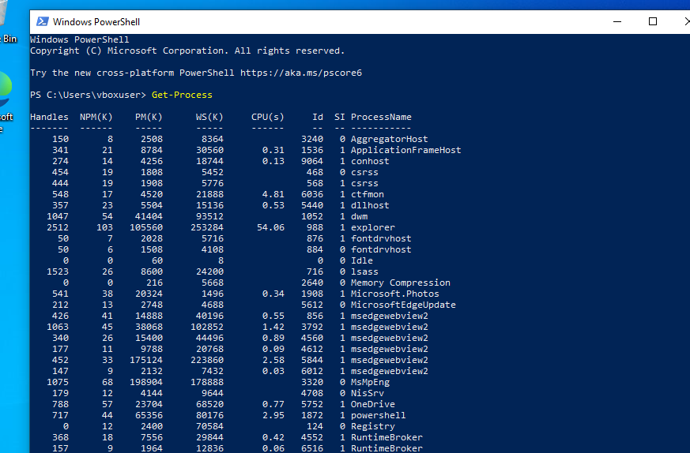

## Задание 5: Фильтрация процессов
```cmd
Get-Process explorer          # Информация о процессе explorer
Get-Process w*                # Все процессы, начинающиеся на "w"
```
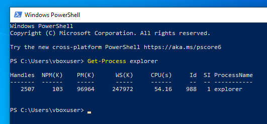


## Задание 6: Форматирование вывода
```cmd
Get-Process i* | Format-List    # Вывод в формате списка
Get-Process i* | Format-Wide    # Широкий формат
Get-Process i* | Format-Custom  # Пользовательский формат
help format*                    # Справка по командам форматирования
```
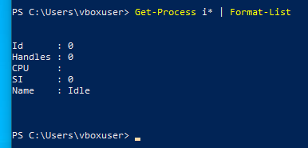
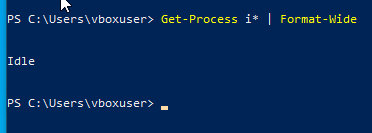
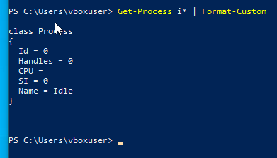
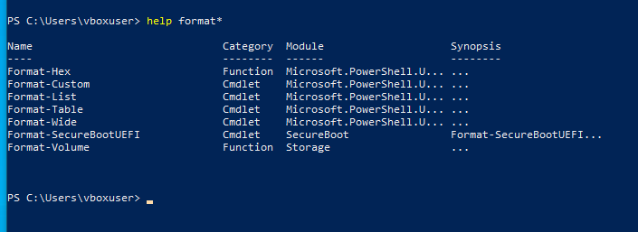

## Задание 7: Изучение свойств объектов
```cmd
Get-Process | Get-Member      # Показать все свойства и методы объектов Process
```
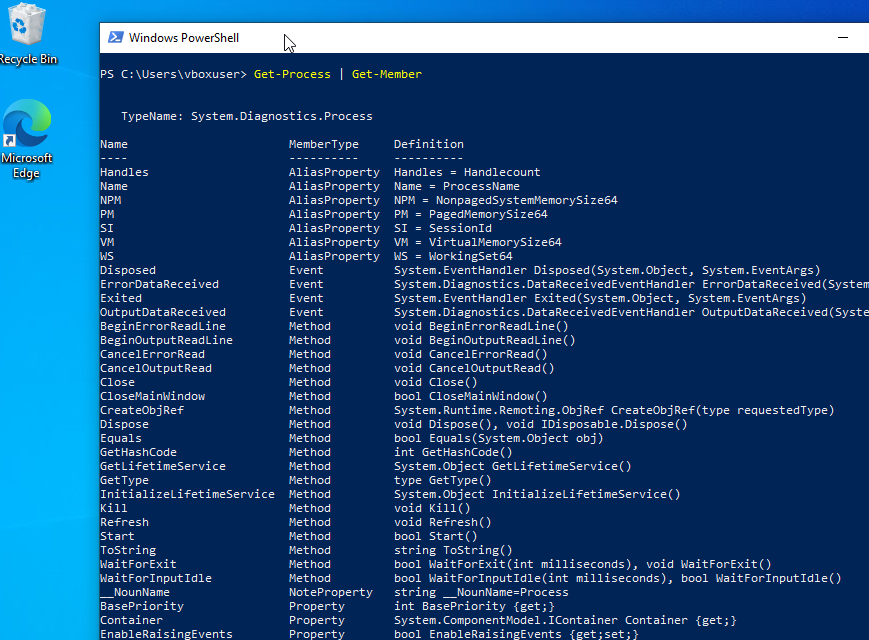

## Задание 8: Фильтрация и сортировка
```cmd
# Фильтрация процессов с handlecount > 400
Get-Process | Where-Object {$_.handlecount -gt 400}

# Сортировка отфильтрованных процессов по Handles
Get-Process | Where-Object {$_.handlecount -gt 400} | Sort-Object Handles
```
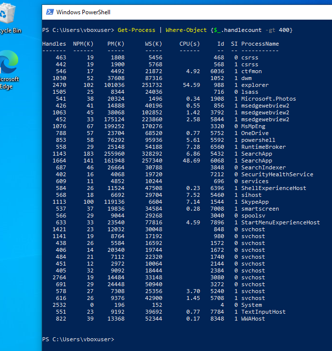
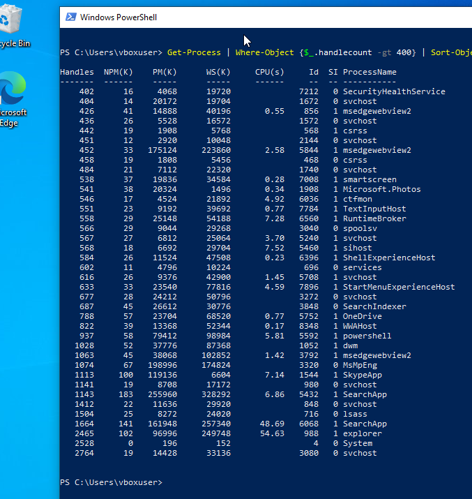

## Задание 9: Сортировка по памяти и выбор топ-5
```cmd
Get-Process | Sort-Object -Property WS -Descending | Select-Object -First 5
```
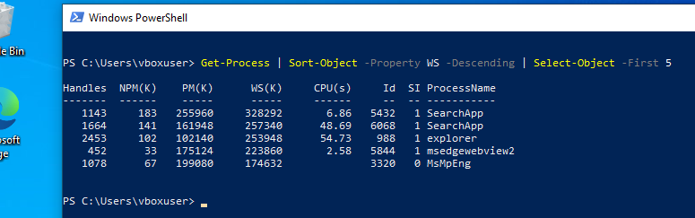

## Задание 10: Управление процессами
```cmd
# Запуск Notepad (Блокнот)
notepad

# Остановка процесса Notepad
Get-Process notepad | Stop-Process

# Запуск Notepad снова
notepad

# Тестовый режим (что если)
Get-Process notepad | Stop-Process -WhatIf

# Режим подтверждения
Get-Process notepad | Stop-Process -Confirm
```
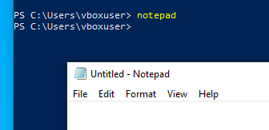
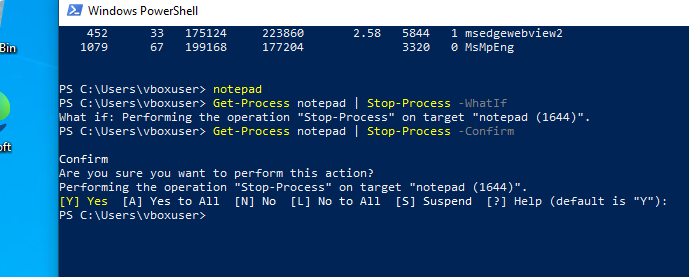

## Задания 11-18: Работа с файловой системой
```cmd
# 11. Создание каталога
New-Item TextFiles -ItemType Directory

# 12. Создание файлов
New-Item psdemo.txt -ItemType File
New-Item 1.txt -ItemType File
New-Item 2.txt -ItemType File

# 13. Копирование файлов
Copy-Item -Path '.\*.txt' -Destination '.\TextFiles'

# 14. Переход в каталог
Set-Location TextFiles

# 15. Переименование файла
Rename-Item psdemo.txt psdemo.bak

# 16. Перемещение файла на уровень выше
Move-Item psdemo.bak ..\

# 17. Возврат на уровень выше
Set-Location ..

# 18. Удаление каталога с содержимым
Remove-Item TextFiles -Recurse
```
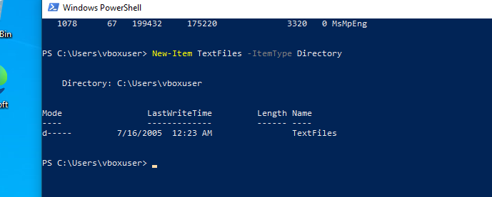
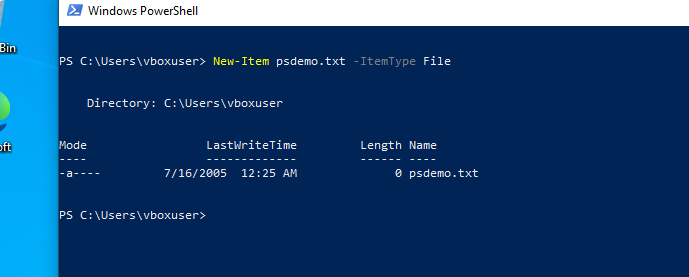
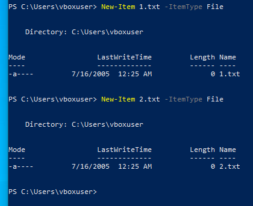
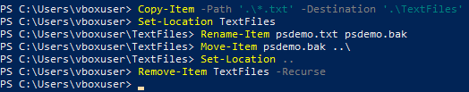
