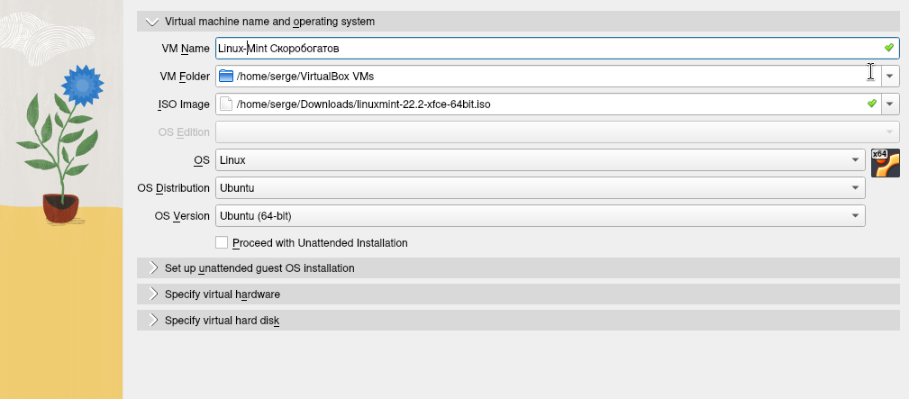
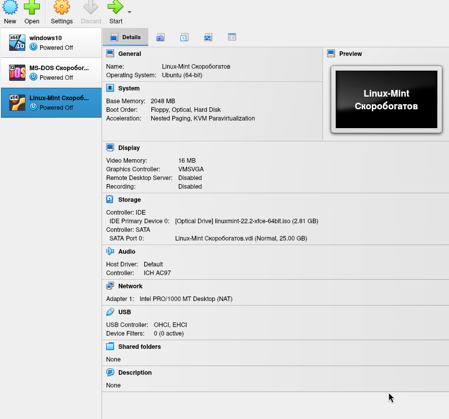
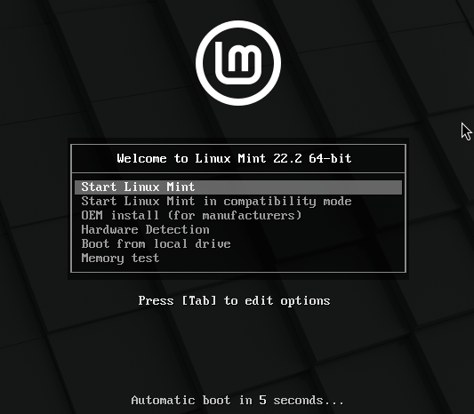
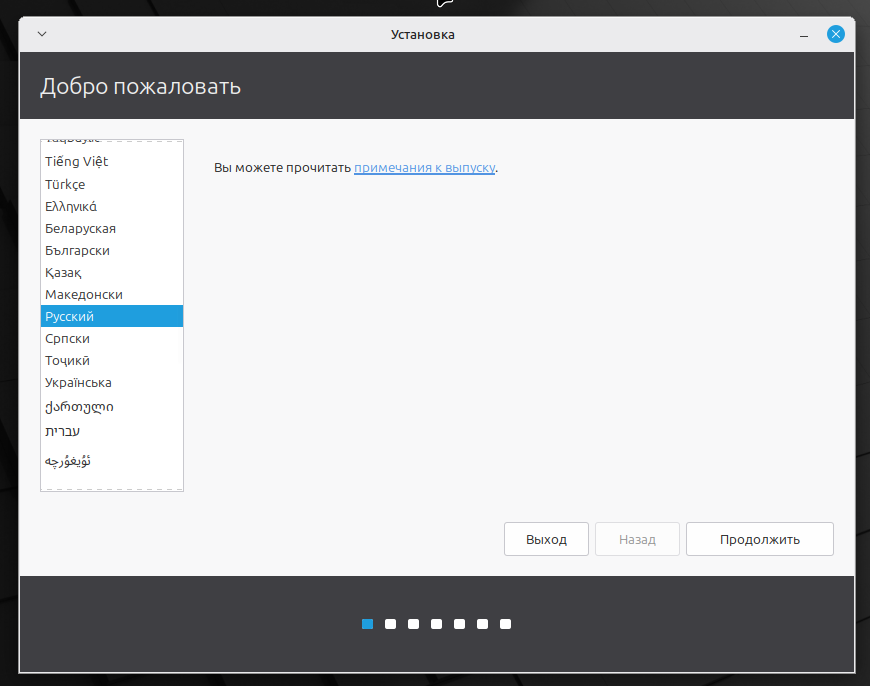
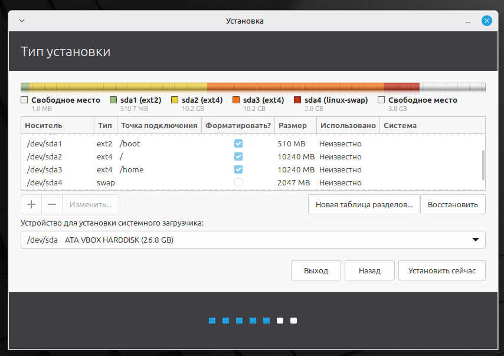
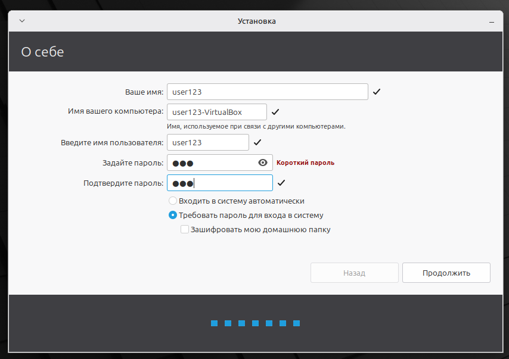
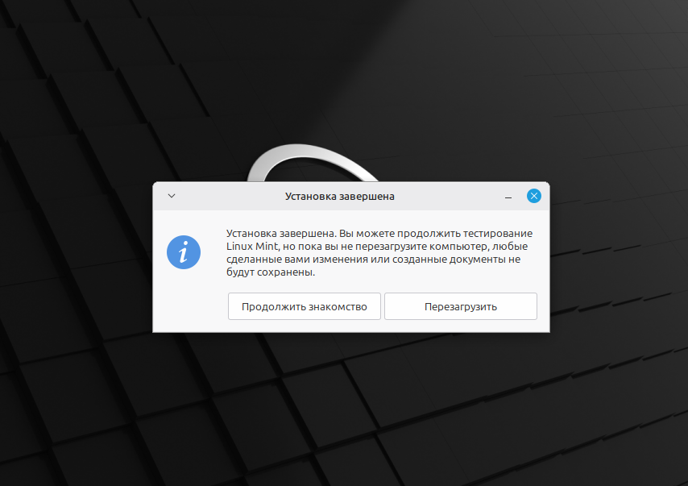
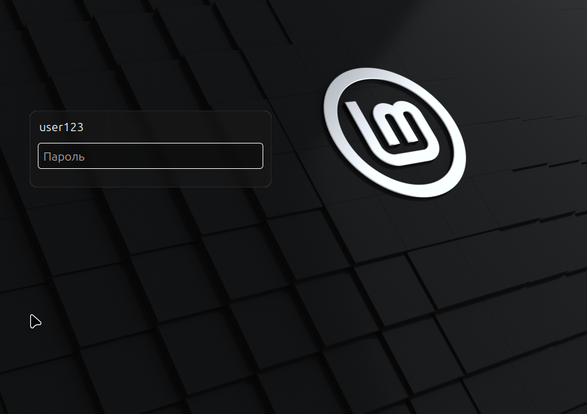
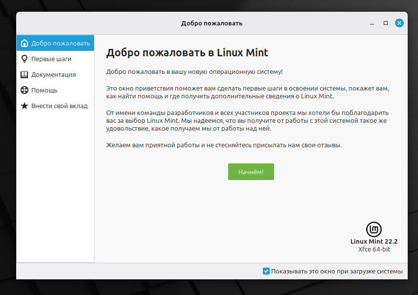

# Лабораторная работа № 5

## Создание виртуальной машины

## Настройка VM перед установкой

## Установка Linux Mint

### Выбор языка и раскладки

### Разметка диска

### Создание пользователя

### Завершение установки

### Первый запуск

